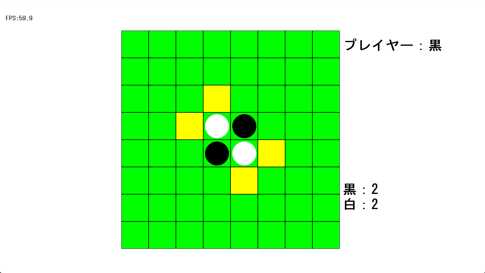
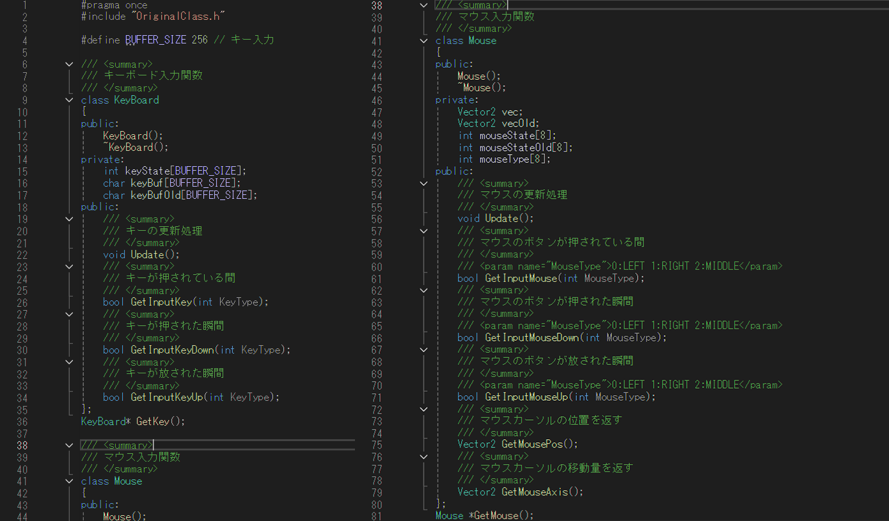
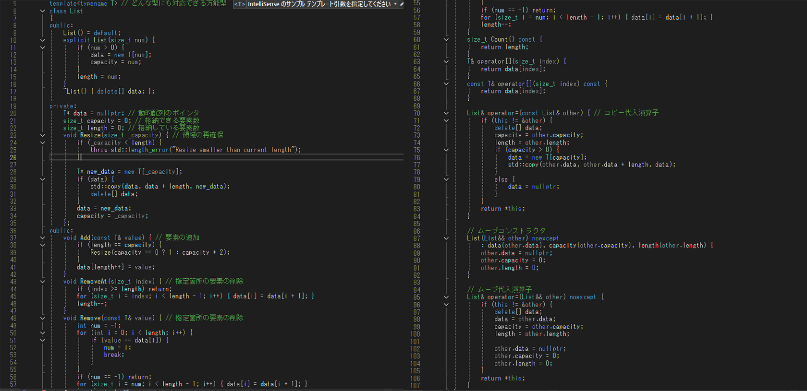

# オセロ - DxLib
DxLibを使用し、C++で制作したオセロゲームです。 
C++への理解を深めるために制作しました。 
&nbsp;

## 概要
C++とDxLibを使用して、ゲームループから各システム基盤までを独自に設計、実装した作品です。 
再利用性の高さを意識して、フレームワークの構築をしていきました。 
また、標準ライブラリに頼らない動的配列クラスの実装にも挑戦しました。 
&nbsp;

## 使用技術
- DxLib
- C++

## 制作期間
1ヶ月

## 制作体制
個人制作

## 見てほしいコード
- **Main.cpp**
  `Project1/Main.cpp` 
プロジェクトの根幹部分
- **SceneManager.cpp**
  `Project1/SceneManager.cpp` 
シーン進行管理、統括
- **OriginalClass.h**
  `Project1/OriginalClass.h` 
UnityのList型やVector2型などを実装している
- **InputSystem.h**
  `Project1/InputSystem.h` 
マウスとキーボードの入力を管理
- **GameDirecter.cpp**
  `Project1/GameDirecter.cpp` 
メインゲーム進行管理
- **Bord.cpp**
  `Project1/Bord.cpp` 
盤面管理

## 時間があればやりたいこと
- オンライン通信
- AI対戦の実装